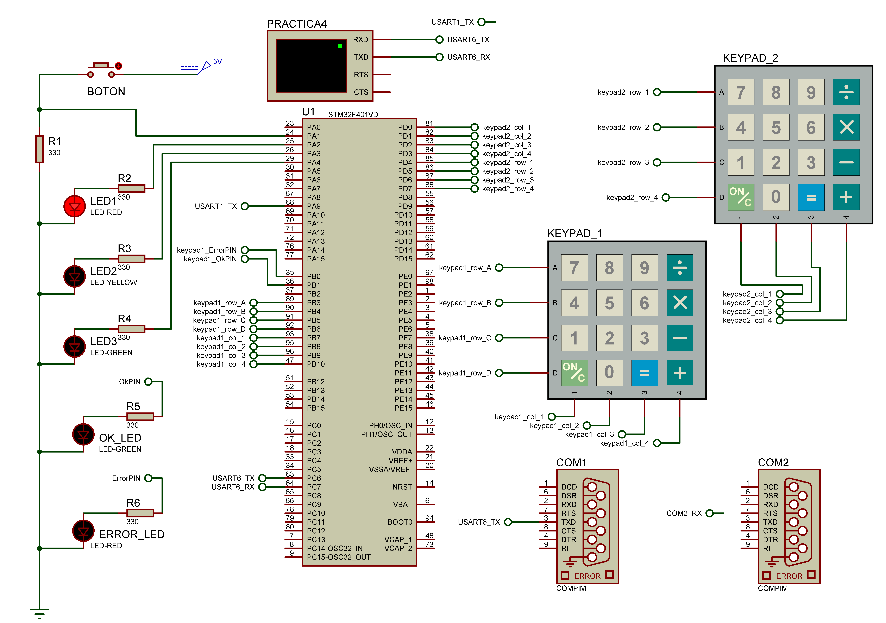

# keypad_STM32_C_Library
This repository contains the library for using a 4x4 matrix keyboard for the STM32F4xx platform. It is written in C language and uses modularization techniques, software deboncing and non-blocking delay functions.

This library allows you to create multiple instances of a keypad and connect them to the microcontroller.
It also allows you to customize the keyboard characters.

# Installation procedure

1. Download the repository files
2. Copy and paste the folder "API" into "Driver" directory of your project.

# Example

## Hardware

**Note:** The connection of the LEDs and buttons is optional, since it does not prevent the reading of the keyboards.

In to your "main.c" file, copy an paste the following code:

## Firmware

1. Create a new project in STMCubeIDE or your preferred IDE for STM32.
2. Copy and paste the following code on your "main.c" file.
3. IMPORTANT! This example uses a instance "USART6" of USART module of the STM32. If your board not have a USART6 module, you need to modify line 38 of the file "API_uart.c" (in the API folder), and change the "USART6" port to the one available on your board. 

~~~
#include "main.h"
#include "stm32f4xx_hal_uart.h"
#include "API_uart.h"
#include "API_delay.h"
#include "API_debounce.h"
#include "API_keypad.h"

#define BOTON GPIO_PIN_1		//Puerto A
#define LED1 GPIO_PIN_2			//Puerto A
#define LED2 GPIO_PIN_3			//Puerto A
#define LED3 GPIO_PIN_4			//Puerto A
#define OK_LED GPIO_PIN_1 		//Puerto B
#define ERROR_LED GPIO_PIN_0	//Puerto B

static delay_t delay_led1;
static delay_t delay_led2;
static delay_t delay_led3;
static uint32_t duration_delay_led1 = 100;
static uint32_t duration_delay_led2 = 500;
static uint32_t duration_delay_led3 = 1000;
static tecla_t keypressed1;
static tecla_t keypressed2;

/**
 * Se indican los pines del micro en los que está conectado el teclado
 */
static keypad_t keypad1 =
{
	.col_1_pin = 7, .col_1_port = 'B',
	.col_2_pin = 8,	.col_2_port = 'B',
	.col_3_pin = 9,	.col_3_port = 'B',
	.col_4_pin = 10, .col_4_port = 'B',

	.row_A_pin = 3,	.row_A_port = 'B',
	.row_B_pin = 4,	.row_B_port = 'B',
	.row_C_pin = 5,	.row_C_port = 'B',
	.row_D_pin = 6,	.row_D_port = 'B',

};

static keypad_t keypad2 =
{
	.col_1_pin = 0, .col_1_port = 'D',
	.col_2_pin = 1,	.col_2_port = 'D',
	.col_3_pin = 2,	.col_3_port = 'D',
	.col_4_pin = 3, .col_4_port = 'D',

	.row_A_pin = 4,	.row_A_port = 'D',
	.row_B_pin = 5,	.row_B_port = 'D',
	.row_C_pin = 6,	.row_C_port = 'D',
	.row_D_pin = 7,	.row_D_port = 'D',

};

static keyboard_t kb_keypad2[4][4] = {	{'7', '8', '9', 'A'},
										{'4', '5', '6', 'B'},
										{'1', '2', '3', 'C'},
										{'*', '0', '#', 'D'}};

void SystemClock_Config(void);
static void MX_GPIO_Init(void);

void secuencia();
void clearOutput();

/**
  * @brief  The application entry point.
  * @retval int
  */
int main(void)
{

  HAL_Init();
  SystemClock_Config();
  MX_GPIO_Init();

  delayInit(&delay_led1, duration_delay_led1);
  delayInit(&delay_led2, duration_delay_led2);
  delayInit(&delay_led3, duration_delay_led3);

  if(uartInit())
  {
	  uartSendString_direct("\n\r***UART inicialized successfuly***\n\r\n\r");
  }
  else{
	  Error_Handler();
  }

  if(keypadInit(keypad1) && keypadInit(keypad2))
  {
	  uartSendString_direct("\n\r***KEYPAD inicialized successfuly***\n\r\n\r");
  }
  else{
	  Error_Handler();
  }

  while (1)
  {
	  keypressed1 = keypadRead(keypad1);
	  keypressed2 = keypadReadUser(keypad2, kb_keypad2);
	  //readKeypad(keypad1, kb_keypad1);
	  //uartSendString_direct("\n\r");

	  //uartSendString_direct("\n\r");
	  uartSendString_direct(&keypressed1);
	  uartSendString_direct(&keypressed2);
	  HAL_GPIO_TogglePin(GPIOA, LED1);
	  HAL_Delay(200);
  }

}

void secuencia()
{

	if (delayRead(&delay_led1)){
		HAL_GPIO_TogglePin(GPIOA, LED1);
	}

	if (delayRead(&delay_led2)){
		HAL_GPIO_TogglePin(GPIOA, LED2);
	}
	if (delayRead(&delay_led3)){
		HAL_GPIO_TogglePin(GPIOA, LED3);
	}

}

void clearOutput()
{
	HAL_GPIO_WritePin(GPIOA, LED1, 0);
	HAL_GPIO_WritePin(GPIOA, LED2, 0);
	HAL_GPIO_WritePin(GPIOA, LED3, 0);

}

/**
  * @brief System Clock Configuration
  * @retval None
  */
void SystemClock_Config(void)
{
  RCC_OscInitTypeDef RCC_OscInitStruct = {0};
  RCC_ClkInitTypeDef RCC_ClkInitStruct = {0};

  /** Configure the main internal regulator output voltage
  */
  __HAL_RCC_PWR_CLK_ENABLE();
  __HAL_PWR_VOLTAGESCALING_CONFIG(PWR_REGULATOR_VOLTAGE_SCALE2);
  /** Initializes the RCC Oscillators according to the specified parameters
  * in the RCC_OscInitTypeDef structure.
  */
  RCC_OscInitStruct.OscillatorType = RCC_OSCILLATORTYPE_HSI;
  RCC_OscInitStruct.HSIState = RCC_HSI_ON;
  RCC_OscInitStruct.HSICalibrationValue = RCC_HSICALIBRATION_DEFAULT;
  RCC_OscInitStruct.PLL.PLLState = RCC_PLL_NONE;
  if (HAL_RCC_OscConfig(&RCC_OscInitStruct) != HAL_OK)
  {
    Error_Handler();
  }
  /** Initializes the CPU, AHB and APB buses clocks
  */
  RCC_ClkInitStruct.ClockType = RCC_CLOCKTYPE_HCLK|RCC_CLOCKTYPE_SYSCLK
                              |RCC_CLOCKTYPE_PCLK1|RCC_CLOCKTYPE_PCLK2;
  RCC_ClkInitStruct.SYSCLKSource = RCC_SYSCLKSOURCE_HSI;
  RCC_ClkInitStruct.AHBCLKDivider = RCC_SYSCLK_DIV1;
  RCC_ClkInitStruct.APB1CLKDivider = RCC_HCLK_DIV1;
  RCC_ClkInitStruct.APB2CLKDivider = RCC_HCLK_DIV1;

  if (HAL_RCC_ClockConfig(&RCC_ClkInitStruct, FLASH_LATENCY_0) != HAL_OK)
  {
    Error_Handler();
  }
}

/**
  * @brief GPIO Initialization Function
  * @param None
  * @retval None
  */
static void MX_GPIO_Init(void)
{
  GPIO_InitTypeDef GPIO_InitStruct = {0};

  /* GPIO Ports Clock Enable */
  __HAL_RCC_GPIOA_CLK_ENABLE();
  __HAL_RCC_GPIOB_CLK_ENABLE();

  /*Configure GPIO pin Output Level */
  HAL_GPIO_WritePin(GPIOA, GPIO_PIN_2|GPIO_PIN_3|GPIO_PIN_4, GPIO_PIN_RESET);

  /*Configure GPIO pin Output Level */
  HAL_GPIO_WritePin(GPIOB, GPIO_PIN_0, GPIO_PIN_RESET);

  /*Configure GPIO pin : PA1 */
  GPIO_InitStruct.Pin = GPIO_PIN_1;
  GPIO_InitStruct.Mode = GPIO_MODE_INPUT;
  GPIO_InitStruct.Pull = GPIO_PULLUP;
  HAL_GPIO_Init(GPIOA, &GPIO_InitStruct);

  /*Configure GPIO pins : PA2 PA3 PA4 */
  GPIO_InitStruct.Pin = GPIO_PIN_2|GPIO_PIN_3|GPIO_PIN_4;
  GPIO_InitStruct.Mode = GPIO_MODE_OUTPUT_PP;
  GPIO_InitStruct.Pull = GPIO_NOPULL;
  GPIO_InitStruct.Speed = GPIO_SPEED_FREQ_VERY_HIGH;
  HAL_GPIO_Init(GPIOA, &GPIO_InitStruct);

  /*Configure GPIO pin : PB0 */
/*  GPIO_InitStruct.Pin = ERROR_LED | OK_LED;
  GPIO_InitStruct.Mode = GPIO_MODE_OUTPUT_PP;
  GPIO_InitStruct.Pull = GPIO_NOPULL;
  GPIO_InitStruct.Speed = GPIO_SPEED_FREQ_VERY_HIGH;
  HAL_GPIO_Init(GPIOB, &GPIO_InitStruct);
*/
}

/* USER CODE BEGIN 4 */

/* USER CODE END 4 */

/**
  * @brief  This function is executed in case of error occurrence.
  * @retval None
  */
void Error_Handler(void)
{
  /* USER CODE BEGIN Error_Handler_Debug */
  /* User can add his own implementation to report the HAL error return state */
  __disable_irq();
  while (1)
  {
	  HAL_GPIO_TogglePin(GPIOB, ERROR_LED);
	  HAL_GPIO_WritePin(GPIOB, OK_LED, 0);
  }
  /* USER CODE END Error_Handler_Debug */
}

void Ok_Handler(void){
	HAL_GPIO_WritePin(GPIOB, OK_LED, 1);
}
~~~

